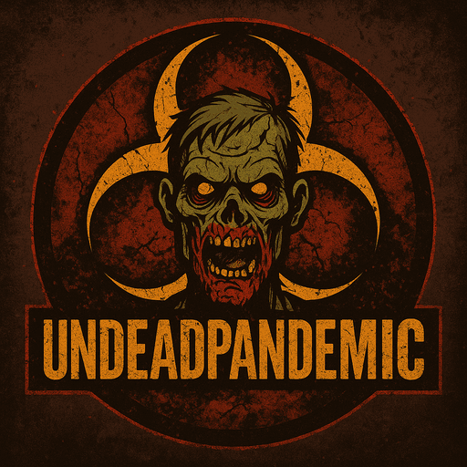

# 🧟‍♂️ UndeadPandemic

<figure><figcaption>
Survive the apocalypse, or become part of it.
</figcaption></figure>

UndeadPandemic is Spigot plugin that turns your SMP Minecraft Server into Zombie-infested post-apocalyptic world!

The aim of the game is to survive, or die trying.

Use any weapons and all the ammo that you can get your hands on, and use medication and first aids kits to heal yourself from injuries and infection!

### Getting Started!


[installation.md](getting-started/installation.md)



[Broken link](/broken/pages/HqigB6KtN3pARrnNNtzp)



[Broken link](/broken/pages/vIbOgTAloYVmIKRHCtcG)



[Broken link](/broken/pages/5jor3e4F5Q4474IVMrnQ)



[Broken link](/broken/pages/2kkNFb7mzTmTwkVjZFvL)



[Broken link](/broken/pages/IDSuXvq0ySVehE59Vvx4)



[Broken link](/broken/pages/dKYCb5VUtb1pLCU5H94Z)



[Broken link](/broken/pages/Nn7j8AJUUaSxhDOvf7zd)



[Broken link](/broken/pages/Qm4EpE1BTkQkyqy6hk3l)

