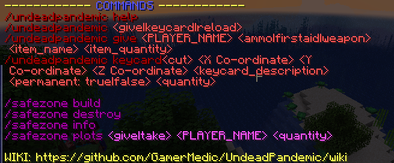

# :help

### Command Structure

`/undeadpandemic`` `<mark style="color:blue;">`help`</mark>

`/undeadpandemic`` `<mark style="color:blue;">`info`</mark>

`/undeadpandemic`` `<mark style="color:blue;">`?`</mark>

### Command Execution

The help command will list the possible commands, as well as a link to this wiki

