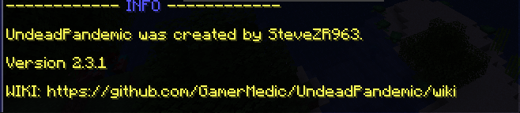

# :info


**Deprecated**

This command is the same as using `/undeadpandemic ?` from v3.0.0.


### Command Structure

`/undeadpandemic`` `<mark style="color:blue;">`info`</mark>

### Command Execution

The `info` command will show the plugin version, creator and contributors, and a link to this wiki.

