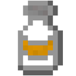

# Antibiotics

### Description

Antibiotics will cure an infection (obviously). The symptoms of infection will be cured, however, antibiotics will not restore health.

### Obtaining Antibiotics

Players with the [firstaid.give permission](../../permissions/undeadpandemic.firstaid/undeadpandemic.firstaid.give.md) can use the [`give firstaid` command](../../commands/undeadpandemic/give/firstaid.md) to give antibiotics to a player.

### Using Antibiotics

Antibiotics can be used by players with the [`firstaid.use` permission](../../permissions/undeadpandemic.firstaid/undeadpandemic.firstaid.use.md) by right-clicking the antibiotics while holding them.
